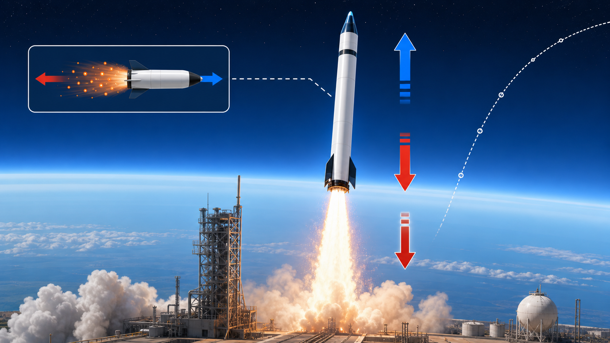

# Lesson 01: What A Rocket Is Actually Doing



A rocket is a machine that accelerates mass backward so the rocket accelerates
forward.

That is the first idea.

Not fire.

Not smoke.

Not "pushing against the air."

A rocket works because it throws mass one way, and the rocket changes motion the
other way.

This lesson builds the first mental model safely and clearly.

We are not building engines, propellants, or hazardous hardware. We are learning
the physics and engineering ideas that make rockets understandable.

## Step 1: Start With The Simple Picture

Imagine you are standing on a very smooth frozen lake.

You hold a heavy ball.

If you throw the ball to the left, your body slides to the right.

Why?

Because before the throw, the total motion of you plus the ball was zero.

After the throw:

```text
ball moves left
you move right
```

The system's total momentum stays balanced.

A rocket does the same thing continuously:

```text
exhaust mass goes backward
rocket goes forward
```

That is the cleanest first model.

## Step 2: Stop Saying Rockets Push Against Air

A common wrong explanation is:

```text
the rocket pushes against the air
```

That cannot be the main explanation because rockets work in space.

Space has no useful air to push against.

The better explanation is:

```text
the rocket pushes exhaust backward
the exhaust pushes the rocket forward
```

This is Newton's third law:

```text
if the rocket pushes exhaust backward,
the exhaust pushes the rocket forward
```

The interaction is between the rocket and its exhaust, not between the rocket
and the atmosphere.

Air matters for drag and aerodynamic stability, but it is not required for
rocket thrust.

## Step 3: Define The System

Physics gets clearer when you choose the system.

For the first model, choose:

```text
system:
    rocket + propellant before exhaust leaves
```

During operation, some propellant becomes exhaust and leaves the rocket.

After a tiny moment:

```text
rocket:
    a little less massive
    moving forward

exhaust:
    moving backward
```

This is why rockets are different from cars.

A car pushes on the road.

A plane pushes on air.

A rocket carries the mass it throws backward.

## Step 4: Momentum Is The First Useful Quantity

Momentum is:

```text
p = m v
```

Where:

```text
p:
    momentum

m:
    mass

v:
    velocity
```

Momentum has direction because velocity has direction.

If right is positive:

```text
rocket moving right:
    positive momentum

exhaust moving left:
    negative momentum
```

The rocket and exhaust momenta balance in the simple model.

## Step 5: Tiny Momentum Example

Suppose a person on ice throws a `2 kg` ball left at:

```text
v_ball = -5 m/s
```

Ball momentum:

```text
p_ball = m v
p_ball = 2 kg * (-5 m/s)
p_ball = -10 kg m/s
```

If the total momentum started at zero, the person must have:

```text
p_person = +10 kg m/s
```

The person moves right.

This is not yet a full rocket calculation, but it gives the correct direction
intuition.

```text
mass thrown left -> remaining body moves right
```

## Step 6: Thrust Is Force

Momentum explains the direction.

Thrust gives the force.

Thrust is the force that pushes the rocket.

Unit:

```text
newton, N
```

A newton is:

```text
1 N = 1 kg m/s^2
```

In a simple rocket picture:

```text
more exhaust mass per second
or faster exhaust
usually means more thrust
```

This is only a first idea. Later lessons will make it more precise with thrust,
mass flow, exhaust velocity, and pressure terms.

## Step 7: The Rocket Is A Changing-Mass System

A rocket carries propellant.

As it runs, propellant leaves as exhaust.

That means:

```text
rocket mass decreases during flight
```

This matters a lot.

A rocket near liftoff is heavy.

Later, after burning propellant, it is lighter.

The same thrust can create more acceleration when the rocket is lighter:

```text
a = F / m
```

If force stays similar and mass gets smaller, acceleration gets larger.

## Step 8: Separate Thrust From Motion

Thrust is a force.

Motion is the result of all forces together.

For a rocket near Earth, important forces include:

```text
thrust:
    usually points roughly along the rocket's engine direction

weight:
    gravity pulls downward

drag:
    air resistance opposes motion through the atmosphere

lift or side force:
    aerodynamic force from airflow and vehicle shape
```

NASA Glenn describes rocket flight using these four forces:

```text
thrust
weight
drag
lift
```

Lesson 02 will focus on those forces.

For now, remember:

```text
thrust alone does not determine motion
net force determines motion
```

## Step 9: First Safe Rocket Model

A safe first model does not need engine details.

Use this model:

```text
rocket is an object with mass
rocket experiences thrust
gravity pulls downward
air may create drag
net force changes velocity
velocity changes position
```

This is enough to start learning rocket flight.

We do not need:

```text
propellant recipes
combustion instructions
hardware construction
dangerous pressure systems
```

This course is about understanding and modeling rockets, not building hazardous
devices.

## Step 10: Tiny Direction Check

Question:

```text
If exhaust moves downward, which way is thrust on the rocket?
```

Answer:

```text
upward
```

Why?

Because the rocket pushes exhaust downward, and the exhaust pushes the rocket
upward.

Question:

```text
If exhaust moves backward, which way is thrust?
```

Answer:

```text
forward
```

That is the basic rocket idea.

## Step 11: Write Your Lesson 01 Notes

Write:

```markdown
# Lesson 01 Notes

## Rocket In One Sentence

A rocket:

## Wrong Explanation

Why "rockets push against air" is not the main explanation:

## Momentum Picture

If exhaust goes backward:

## Thrust

Thrust is:
Unit:

## Changing Mass

Why rocket mass changes during flight:

## Safe Scope

This course studies:
This course does not teach:
```

Keep the notes short. The goal is to get the first mental model right.

## Done Checklist

You are done when:

- you can explain that rockets accelerate mass backward
- you can explain why rockets do not need air to produce thrust
- you can describe the rocket and exhaust momentum picture
- you can define thrust as a force
- you know rocket mass changes during flight
- you know the course stays conceptual, mathematical, and simulation-safe

Stop here. Lesson 02 studies the forces on a rocket.
